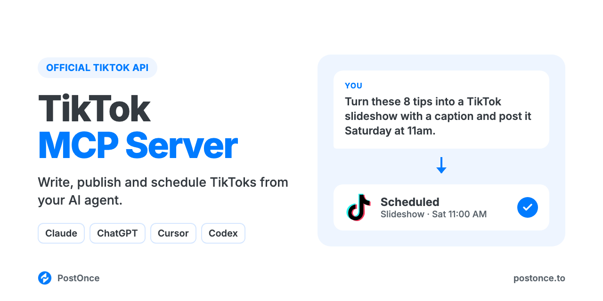

<p align="center"></p>

# TikTok MCP Server

TikTok MCP server for Claude, ChatGPT, Cursor and Codex. Your AI agent can write, publish and schedule TikTok videos and photo slideshows, or send them to your TikTok inbox as drafts, through TikTok's official API. There's no scraping, no browser automation and no TikTok developer app to set up.

It runs on [PostOnce](https://postonce.to)'s hosted MCP server and comes with TikTok skills for scripts, hooks, captions, hashtags and slideshows, so your agent knows what works on TikTok before it posts.

```
You:    Here's my video on meal prepping for the week. Write the caption and
        post it tomorrow at 6pm with duets turned off.
Claude: Wrote it with the tiktok-caption-generator skill. The first line says
        "5 lunches for $20, prepped in one hour" so it matches what people
        search, with 4 hashtags at the end. Scheduled on PostOnce for
        tomorrow 18:00 on @mealprepmaya, duets off.
```

## What you can do

| Ask your agent to | How it works |
| --- | --- |
| Post a video now (up to 10 minutes, 4 GB) | `create_upload_url`, upload, then `create_post` with `media` |
| Post a photo slideshow (1 to 35 images, JPEG or WEBP) | Upload each image, then `create_post` with the images in order |
| Schedule a post for later | `create_post` with `publish_at` |
| Send it to your TikTok inbox as a draft to finish in the app | `platform_options: { "publish_mode": "draft" }` |
| Set who can see it, or turn off comments, duets or stitches | `platform_options`: `privacy` (`public`, `friends`, `followers`, `private`), `comments`, `duet`, `stitch` set to `false` |
| Pick the video cover | `video_cover_timestamp_ms` in `platform_options`, or a `thumbnail_url` on the video |
| Label a video as AI-generated | `platform_options: { "ai_generated": true }` (direct video posts) |
| Save a draft in PostOnce to finish later | `create_draft` |
| Check whether a post went out, and get its URL | `get_post` |
| Change or cancel a scheduled post | `update_post`, `cancel_post` |
| Post the same video to TikTok and other platforms | Add more targets to `create_post` (Instagram, YouTube, LinkedIn, X, Threads, Facebook, Pinterest, Bluesky) |

Not supported: text-only posts, GIFs, mixing photos and video in one post, choosing the music on a slideshow (TikTok adds music to photo posts automatically), TikTok Stories and LIVE, analytics, reading or replying to comments, DMs, and editing or deleting posts after they're published. Captions over 2,200 characters are cut off, and hashtags beyond 5 are removed.

## Setup (about a minute)

You need a [PostOnce account](https://postonce.to) (free for 7 days, no card) with your TikTok account connected.

**Claude (claude.ai and desktop) and ChatGPT:** add a custom connector with the URL below and sign in with PostOnce. No API key.

```
https://postonce.to/mcp
```

Step-by-step: [Claude](https://postonce.to/integrations/claude) · [ChatGPT](https://postonce.to/integrations/chatgpt)

**Claude Code, Codex and Cursor:** install this repo as a plugin. It adds the MCP connection and the skills below together. Create an API key in [PostOnce preferences](https://postonce.to/dashboard/preferences) and give it to your client as the `POSTONCE_API_KEY` environment variable. Never paste the key into chat.

```bash
# Claude Code
claude plugin marketplace add postoncehq/plugins
claude plugin install tiktok-mcp@postoncehq
```

Step-by-step: [Claude Code](https://postonce.to/integrations/claude-code) · [Codex](https://postonce.to/integrations/codex) · [Cursor](https://postonce.to/integrations/cursor)

**Any other MCP client:** point it at `https://postonce.to/mcp` (Streamable HTTP) with the header `Authorization: Bearer <your PostOnce API key>`.

## Skills included

| Skill | What it does |
| --- | --- |
| [`tiktok-script-generator`](skills/tiktok-script-generator/SKILL.md) | Writes short-form video scripts: the hook, the beats, on-screen text, B-roll and the ending. |
| [`tiktok-hook-generator`](skills/tiktok-hook-generator/SKILL.md) | Gives 10 first-3-second hooks for a topic, each with the spoken line, the on-screen text and the opening shot. |
| [`tiktok-caption-generator`](skills/tiktok-caption-generator/SKILL.md) | Writes captions built for TikTok search: the keyword up front, a clear line of context, and up to 5 hashtags. |
| [`tiktok-slideshow-maker`](skills/tiktok-slideshow-maker/SKILL.md) | Plans and builds a photo-mode slideshow (up to 35 images at 1080×1920 or 1080×1440), with the caption. |
| [`tiktok-hashtag-generator`](skills/tiktok-hashtag-generator/SKILL.md) | Picks 3 to 5 hashtags that describe the video, mixing topic and niche tags. |
| [`tiktok-bio-generator`](skills/tiktok-bio-generator/SKILL.md) | Writes TikTok bio options that fit in 80 characters, for you to paste into your profile. |
| [`tiktok-content-calendar`](skills/tiktok-content-calendar/SKILL.md) | Plans 1 to 4 weeks of TikToks from your goals or a source you already have, then schedules them. |
| [`postonce`](skills/postonce/SKILL.md) | Publishing workflow: pick the right account, upload media, schedule, and confirm the post actually went live. |

## FAQ

**Is there an official TikTok MCP server?**
This server uses TikTok's official API through PostOnce. Your agent talks to PostOnce over MCP, and PostOnce publishes through TikTok's official posting API with the permissions you grant when you connect.

**Can Claude post to TikTok?**
Yes, once it's connected to an MCP server that can publish, like this one. Claude writes the caption, uploads your video or images, then calls `create_post`.

**Is it safe for my TikTok account?**
Yes. Posts go through TikTok's official API. Many TikTok MCP servers on GitHub drive a logged-in browser session or an unofficial, scraped API instead, which TikTok's terms don't allow and which can get accounts restricted.

**Do I need a TikTok developer app or API approval?**
No. PostOnce holds the TikTok API access; you just connect your account.

**Can it post TikTok slideshows (photo mode)?**
Yes. Send 1 to 35 JPEG or WEBP images in order and they post as a photo post. TikTok adds music to photo posts automatically; you can't pick the sound through the API.

**Can it save a post as a draft in TikTok?**
Yes. Set `publish_mode` to `draft` and the post lands in your TikTok inbox, where you finish it (add a sound, edit, post) in the app. A video draft arrives without its caption, so paste the caption in TikTok before posting.

**Is it free?**
The skills and this repo are free and MIT-licensed. Publishing runs through a PostOnce account, which you can try free for 7 days without entering a card. After that, see [pricing](https://postonce.to/pricing).

## Other platforms

The same connection posts everywhere PostOnce supports. Platform repos with their own skills:
[LinkedIn MCP](https://github.com/postoncehq/linkedin-mcp) · [Instagram MCP](https://github.com/postoncehq/instagram-mcp) · [YouTube MCP](https://github.com/postoncehq/youtube-mcp) · [Facebook MCP](https://github.com/postoncehq/facebook-mcp) · [X (Twitter) MCP](https://github.com/postoncehq/x-mcp) · [Threads MCP](https://github.com/postoncehq/threads-mcp) · [Bluesky MCP](https://github.com/postoncehq/bluesky-mcp) · [Pinterest MCP](https://github.com/postoncehq/pinterest-mcp)

## License

MIT. See [LICENSE](LICENSE).
